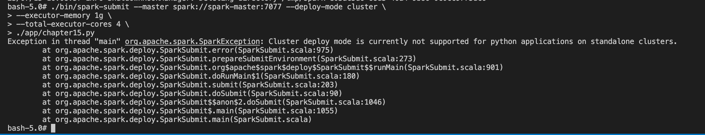

# 스파크 완벽 가이드 15-16 챕터 리뷰

- 스파크 완벽 가이드 15-16 챕터는 다음과 같은 내용을 다루고 있습니다.

  - 15장 : 스파크에는 여러가지 실행 모드가 있으며 기본적으로 작업을 병렬처리로 수행하게 됩니다. 스파크에서 이러한 작업을 진행할 때 클러스터가 어떻게 동작하는 지 설명하는 챕터 였습니다.
  - 16장 : 언어별로 간단하게 스파크 어플리케이션을 개발 , 실행하는 방법과 실행에 대한 옵션들을 소개 합니다.

- 15 챕터에서 설명하고 있는 내용을 재구성하여 로컬에 스파크 클러스터를 띄우고 실행하고 클러스터가 어떻게 동작하는 지 확인합니다.
- 16 챕터에서 다루는 일부 옵션을 사용해서 간단한 etl 어플리케이션을 만들고 실행해봅니다.

## spark cluster 빌드 하기

```
docker-compose up
```

localhost:8080 에서 worker 에 대한 정보를 확인 할 수 있습니다.

### spark cluster 에서 chapter15.py 실행하기

로컬에 spark 가 설치되어 있다면 로컬 드라이버를 활용하여 spark 를 실행할 수 있고 이를 client mode 라고 한다고 합니다.

```
spark-submit --master spark://localhost:7077 \
--executor-memory 1g \
--total-executor-cores 4 \
./app/chapter15.py
```

로컬에 spark 가 존재하지 않다면 spark-master shell 에 들어가서 아래 스크립트를 실행 하는 것으로 작업을 제출 할 수 있습니다.

```
./bin/spark-submit --master spark://spark-master:7077 \
--executor-memory 1g \
--total-executor-cores 4 \
./app/chapter15.py
```

현재 환경에서는 cluster mode 로는 실행이 불가능한데 실습 환경은 spark standalone cluster 이기 때문에 파이썬 어플리케이션의 경우 지원을 하지 않는다고 합니다.


spark-submit 을 사용하지 않고 pyspark 를 실행하게되면 localhost:4040 에서 job 에 대한 내용을 좀 더 상세하게 확인 할 수 있는데 (로컬모드) 디버깅이 필요한 환경에서는 pyspark 혹은 spark-shell 등에서 대화형 식으로 개발을 해나가는게 좀 더 편할 수 있다는 생각이 들었습니다.

spark 스테이지가 어떻게 쪼개지는지 설명할 수 있으면 좋을듯함.

### spark 에서 mysql insert 하기 (chapter 16 대체)

docker-compose 에서 실행된 mysql 에 아래 쿼리를 실행해서 데이터베이스 및 테이블을 생성 합니다.

```
# 데이터베이스를 생성합니다.
CREATE SCHEMA `test` ;
# 테이블을 생성 합니다.
CREATE TABLE `test`.`test` (
  `id` INT NULL);
ALTER TABLE `test`.`test`
ADD INDEX `id_index` (`id` ASC) VISIBLE;
;

```

df_to_mysql.py 어플리케이션을 실행하여 spark 에서 생성한 df 를 mysql 로 insert 해줍니다.

```
./bin/spark-submit --packages mysql:mysql-connector-java:8.0.26 \
--master spark://spark-master:7077 \
--executor-memory 1g \
--total-executor-cores 4 \
./app/df_to_mysql.py
```

어플리케이션이 실행 되면 mysql 에서 processlist 를 확인 합니다.

```
select * from information_schema.processlist where STATE="update";
select count(*) from test.test;
```

write 하는 데이터프레임의 파티션 수와 total executor cores 의 수의 맞춰 mysql 상에서 병렬 insert 가 일어나는 것을 확인 할 수 있습니다.

로컬에서 테스트 하는 용도로 pyspark 를 실행할 때에도 --packages 에 mysql-connector 를 추가해주어야 합니다.

```
./bin/pyspark --packages mysql:mysql-connector-java:8.0.26
```

### spark 에서 mysql to mongodb etl 하기 (chapter 16 대체)

아래 스크립트를 통해 mysql to mongodb etl 어플리케이션을 실행 할 수 있습니다.

```
./bin/spark-submit --packages mysql:mysql-connector-java:8.0.26,org.mongodb.spark:mongo-spark-connector_2.12:10.2.0 \
--master spark://spark-master:7077 \
--executor-memory 1g \
--total-executor-cores 8 \
./app/mysql_to_mongodb.py
```

로컬에서 테스트 시에 mongodb , mysql 라이브러리를 추가 해야 합니다.

```
./bin/pyspark --packages mysql:mysql-connector-java:8.0.26,org.mongodb.spark:mongo-spark-connector_2.12:10.2.0
```

### 알 수 있었던 점.

- 어플리케이션 실행 시 처리하는 df 혹은 rdd 의 partition 수와 execute core 수에 맞춰 분산 처리가 일어납니다.
- 무조건 분산처리 되는 수를 늘린다고 성능에 좋은 영향을 끼치는 것은 아닙니다. (데이터베이스)
